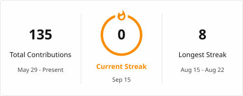

<picture>
  <source
    media="(prefers-color-scheme: dark)"
    srcset="https://raw.githubusercontent.com/insafibrahimp-create/insafibrahimp-create/main/dark.svg">

  <source
    media="(prefers-color-scheme: light)"
    srcset="https://raw.githubusercontent.com/insafibrahimp-create/insafibrahimp-create/main/light.svg">

  
</picture>

<h2 align="center">📊 GitHub Statistics</h2>

  
  

<h2 align="center">🔥 GitHub Streak</h2>

  

<h2 align="center">🐍 Contribution Snake</h2>

  <picture>
    <source
      media="(prefers-color-scheme: dark)"
      srcset="https://raw.githubusercontent.com/insafibrahimp-create/insafibrahimp-create/output/github-snake-dark.svg">
    <source
      media="(prefers-color-scheme: light)"
      srcset="https://raw.githubusercontent.com/insafibrahimp-create/insafibrahimp-create/output/github-snake.svg">
    
  </picture>

